# Environment Names and Account Numbers (EU vs US)


---

## Alternative 1: Side-by-Side Comparison (LR Flowchart)


---

## Alternative 2: Class Diagram


---

## Alternative 3a: Mindmap View with Emoji Differentiation

```mermaid
mindmap
  root((Cloud Environments))
    EU Region
      🔴 DEV Mobile Dev
        31518660332
      🔵 INT EU-INT
        858308689720
      🟡 QA EU-QA
        568730585496
      🟦 TEST EU-System Test
        450234543935
      🟣 PERF 10xPerf
        516989349834
      🟠 STAGE EU-Staging
        761042451864
      🟢 PROD EU-Commercial
        425557308772
      🩷 CLINICAL EU-Clinical
        576542144457
    US Region
      🔴 DEV Mobile Dev
        31518660332
      🔵 INT Cloud-INT
        444235492013
      🟡 QA US-QA
        685815368936
      🟦 TEST US-SystemTest
        798382343803
      🟣 PERF 10xPerf
        516989349834
      🟠 STAGE US-Staging
        761042451864
      🟢 PROD US-Commercial
        699069681480
      🩷 CLINICAL US-Clinical
        673098177177
```



---

## Alternative 3b: Mindmap View with Brackets Differentiation

```mermaid
mindmap
  root((Cloud Environments))
    EU Region
      [DEV] Mobile Dev
        31518660332
      [INT] EU-INT
        858308689720
      [QA] EU-QA
        568730585496
      [TEST] EU-System Test
        450234543935
      [PERF] 10xPerf
        516989349834
      [STAGE] EU-Staging
        761042451864
      [PROD] EU-Commercial
        425557308772
      [CLINICAL] EU-Clinical
        576542144457
    US Region
      [DEV] Mobile Dev
        31518660332
      [INT] Cloud-INT
        444235492013
      [QA] US-QA
        685815368936
      [TEST] US-SystemTest
        798382343803
      [PERF] 10xPerf
        516989349834
      [STAGE] US-Staging
        761042451864
      [PROD] US-Commercial
        699069681480
      [CLINICAL] US-Clinical
        673098177177
```

---

## Alternative 3c: Mindmap View with Symbols

```mermaid
mindmap
  root((Cloud Environments))
    EU Region
      ⚡ DEV | Mobile Dev
        31518660332
      🔄 INT | EU-INT
        858308689720
      ✓ QA | EU-QA
        568730585496
      🧪 TEST | EU-System Test
        450234543935
      🚀 PERF | 10xPerf
        516989349834
      📦 STAGE | EU-Staging
        761042451864
      💼 PROD | EU-Commercial
        425557308772
      🏥 CLINICAL | EU-Clinical
        576542144457
    US Region
      ⚡ DEV | Mobile Dev
        31518660332
      🔄 INT | Cloud-INT
        444235492013
      ✓ QA | US-QA
        685815368936
      🧪 TEST | US-SystemTest
        798382343803
      🚀 PERF | 10xPerf
        516989349834
      📦 STAGE | US-Staging
        761042451864
      💼 PROD | US-Commercial
        699069681480
      🏥 CLINICAL | US-Clinical
        673098177177
```



**Legend:**
- 🔴 / ⚡ **DEV** - Development environment
- 🔵 / 🔄 **INT** - Integration testing
- 🟡 / ✓ **QA** - Quality assurance
- 🟦 / 🧪 **TEST** - System testing
- 🟣 / 🚀 **PERF** - Performance testing
- 🟠 / 📦 **STAGE** - Pre-production staging
- 🟢 / 💼 **PROD** - Commercial production
- 🩷 / 🏥 **CLINICAL** - Clinical production

---

## Alternative 4: Block Diagram (Compact Boxes)


---

## Alternative 5: Quadrant Chart (by Environment Type)


---

## Alternative 6: Simple List Format


---

## Standard Table View

| EU Environment Name | EU Account # | US Environment Name | US Account # |
|---------------------|--------------|---------------------|--------------|
| Mobile Dev | 31518660332 | Mobile Dev | 31518660332 |
| EU-INT | 858308689720 | Cloud-INT | 444235492013 |
| EU-QA | 568730585496 | US-QA | 685815368936 |
| EU-System Test | 450234543935 | US-SystemTest | 798382343803 |
| 10xPerf | 516989349834 | 10xPerf | 516989349834 |
| EU-Staging | 761042451864 | US-Staging | 761042451864 |
| EU-Commercial | 425557308772 | US-Commercial | 699069681480 |
| EU-Clinical | 576542144457 | US-Clinical | 673098177177 |
